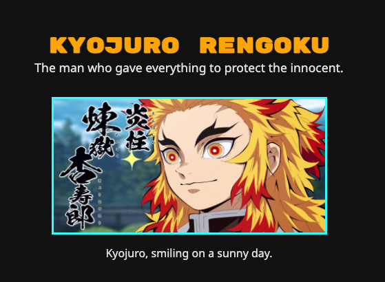

# Tribute Page for Kyojuro

## Description

This is a single-page html/css website.
It is the first of five web design projects from Free Code Camp's Responsive Web Design course. This course emphasizes the use of semantic html tags for the sake of accessibility.

## Subject Matter

The theme for this project was to create a website dedicated to honoring someone influential.  
I chose to dedicate my website to the fictional character Kyojuro, who is based off the Demon Slayer anime.

## Technial Requirements

Per requirements, certain elements were required to be on the page such as at least on image element, a link, etc. These elements were also required to have specific id attributes. Even though I included all required id attributes in order to fulfill the checklist, I did not find it necessary to use all the id attributes during styling.

# Colors

I kept my color palette simple. I used orange for headings and I sparingly used cyan to border the image and to make the link pop.

# Animation

My favorite aspect of this website is how the image animates to reveal itself upon page load. I accomplished this via the `@keyframes` keyword. I hope to animate more elements this way on future projects.
